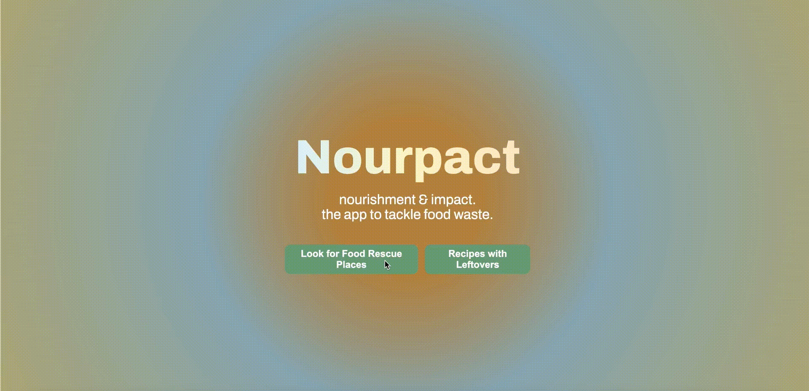
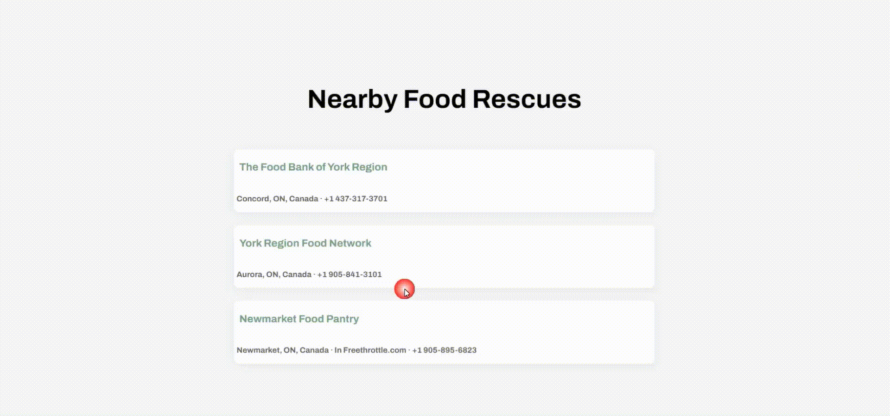

# Nourpact (Nourishment and Impact) 🥫🍎🍳
░░░░░░░░░░░░░░░░░░░░░░░░░░░░░░░░░░░░░░░░░░░░░░░░░░░░
░░░░░░░░░░░░░░░░░░░░░░░░░░░░░░░░░░░░░░░░░░░░░░░░░░░░
░░░███░░█░░███░░█░█░░████░░████░░███░░░████░░█████░░
░░░█░██░█░░█░█░░█░█░░█░░█░░█░░█░░█░█░░░█░░░░░░░█░░░░
░░░█░░███░░█░█░░█░█░░████░░████░█████░░█░░░░░░░█░░░░
░░░█░░░░█░░███░░███░░█░█░░░█░░░░█░░░█░░████░░░░█░░░░
░░░░░░░░░░░░░░░░░░░░░░░░░░░░░░░░░░░░░░░░░░░░░░░░░░░░

      _        ,..
 ,--._\\_.--, (-00)
; #         _:(  -) -- **Scroll Down to Read More!** 
:          (_____/
:            :
 '.___..___.`

Note: Domain (nourpact.tech) from domain.com.

## Inspiration 💡
Food waste is a rising environmental issue caused by overproduction, overbuying, etc. As a result, 1.3 billion tons of food is wasted every year, emitting 3.3 billion metric tons of carbon dioxide, and 35% of food waste is produced by supermarkets throwing away perfectly edible food. We were inspired by these facts and our experience to build a web application to help others reduce their food waste.

## What it does 🍎
Nourpact helps users to reduce their food waste by locating a food rescue organization near them to give unwanted food items and looking up recipes using their food items.

## How it Works 🤖
1. Choose if you want to look for a food rescue place or find recipes for your unwanted food items.

2. If you choose to find recipes, type in the food items you have and Nourpact will look for recipes using those ingredients.

3. if you choose to find a food rescue place near you, Nourpact will look for the three nearest food rescues.

## How we built it 🔧
To build our application, we used ReactJS and CSS and the API we used was SerpApi. We hosted our web application on Netlify and our domain is from domain.com. We initially designed our application using Figma to create mockups.

**How Nourpact gets Recipes for Leftovers:**
1. User inputs their leftover food
2. Nourpact converts input into a query 
3. SerpAPI scrapes Google for recipes 
4. NourPact converts and filters scrapped data into usable data
5. Displays and formats data as images, titles, and links

**How Nourpact gets Nearby Food Rescues:**
1. User requests a search
2. NourPact Calls SerpAPI with location parameters
3. SerpAPI scraps google for Food rescues
4. NourPact converts and filters scrapped data to usable data
5. Displays and formats data as titles, locations, and links

## Challenges we ran into 🗺️
We faced multiple challenges throughout the hackathon. We ran into issues combining our files since we were relatively new to ReactJS and were working on different files but in the end, we were able to resolve code conflicts. Another challenge we faced was getting the API to work. We also had to cut down on some of the ideas we had planned due to time constraints.

## Accomplishments that we're proud of 🏆
For everyone on the team, SimpliHacks 2.0 is our first hackathon and we are proud of being able to build a product that could potentially impact different communities. We are also proud that we learned how to use ReactJS, an API to scrape data, and an industry-standard design tool like Figma during the hackathon. 

## What we learned 🧠
Not only did we learn ReactJS, SerpAPI, and Figma but also learned how to be better team members and the importance of communications on projects like these! 

## What's next for Nourpact ⏭️
We will continue to improve on Nourpact to make it more functional and implement more features! 

Built With ReactJS, CSS, SerpAPI, and Figma ❤️

